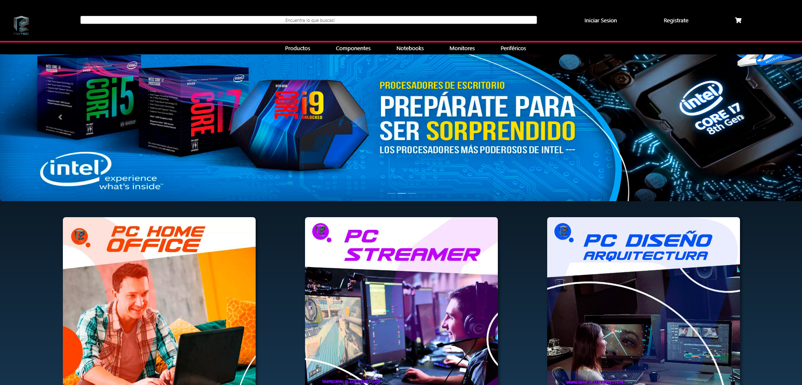
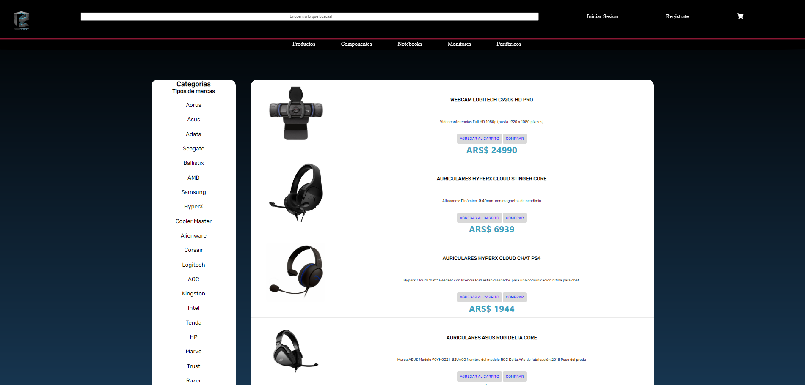
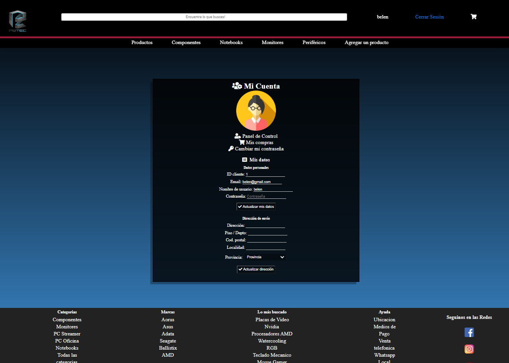

# P2TEC - Ecommerce tecnologico

https://github.com/arkaaczina/grupo8-P2TEC-8-P2TEC/new/master?readme=1

# Install instructions
1. `npm install`
2. db configs: check folder `/database/config/`
3. db structure in `/labasededatos`
4. npm i cors
5. nodemon app.js - abre localhost3030
6. cd dashboard-p2tec/ 
7. npm install
8.npm start

# Sistema de formularios: Minimalista

